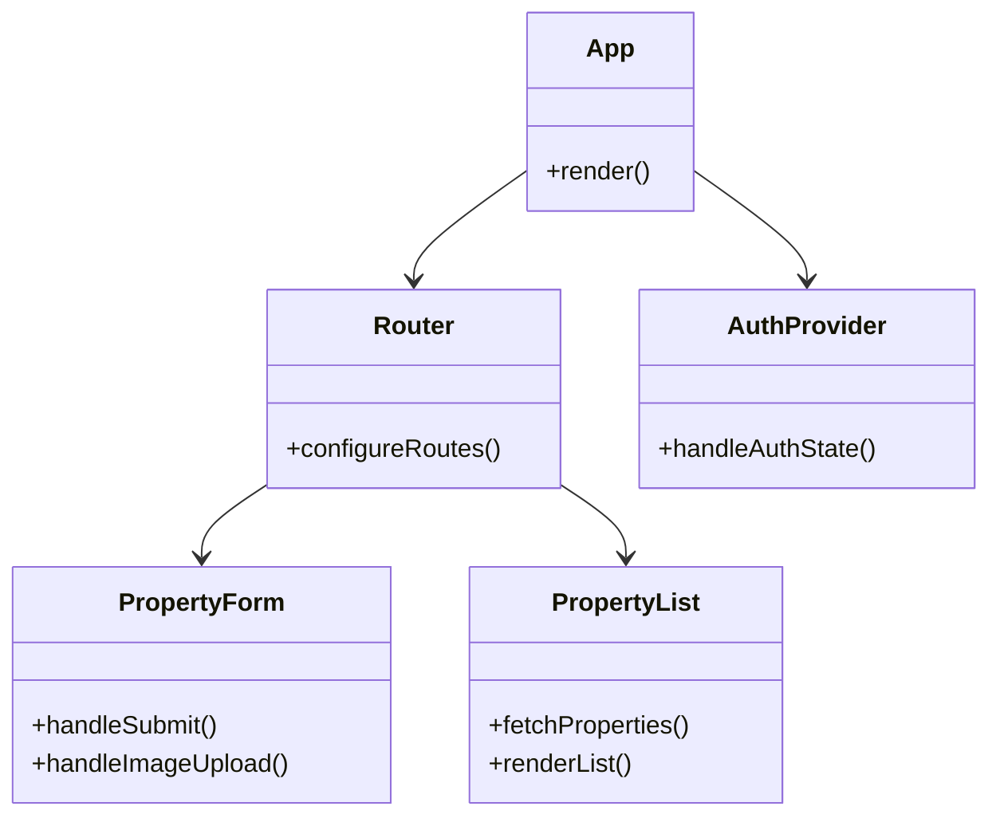

# Eluma Frontend Documentation

## Overview
Eluma is a modern property management web application built with React and Vite. It provides a user-friendly interface for managing property listings, user authentication, and property-related features.

## Tech Stack
- **Framework**: React 18
- **Build Tool**: Vite
- **UI Framework**: TailwindCSS + DaisyUI
- **Routing**: React Router v7
- **State Management**: React Hooks
- **API Client**: Axios
- **Rich Text Editor**: React-Quill
- **Drag & Drop**: React Beautiful DnD
- **Authentication**: js-cookie

## Architecture

### Project Structure
```
src/
├── components/        # Reusable UI components
├── views/            # Page components
│   ├── admin/        # Admin dashboard
│   ├── auth/         # Authentication pages
│   ├── getMyPeopery/ # Property management
│   ├── home/         # Landing pages
│   └── user/         # User profile pages
├── service/          # API services
└── utils/           # Utility functions
```

### Component Architecture



## Key Features

### 1. Property Management
- Add new properties with detailed information
- Rich text editor for property descriptions
- Drag and drop image upload
- Property type categorization
- Location management
- Availability scheduling
- Facility management

### 2. User Authentication
- Secure login/register system
- Token-based authentication
- Role-based access control
- Session management

### 3. Property Features
- Multiple property types
- Detailed property information
- Pricing management
- Availability calendar
- Facility tracking
- Owner information

## Setup Instructions

1. Install dependencies:
```bash
npm install
```

2. Start development server:
```bash
npm run dev
```

3. Build for production:
```bash
npm run build
```

4. Preview production build:
```bash
npm run preview
```

## Environment Setup

Create a `.env` file in the root directory with the following:
```
VITE_API_URL=http://localhost:3000
VITE_APP_NAME=Eluma
```

## Development Guidelines

### Code Style
- Use ESLint for code linting
- Follow React best practices
- Use TailwindCSS for styling
- Implement proper error handling
- Use async/await for API calls

### Component Structure
```typescript
interface ComponentProps {
    // Props interface
}

const Component: React.FC<ComponentProps> = ({ props }) => {
    // Component implementation
    return <div>Component</div>;
};

export default Component;
```

## API Integration

### Authentication
```typescript
// Login
POST /auth/login
POST /auth/register

// Property Management
POST /properties
GET /properties
GET /properties/:id
PUT /properties/:id
DELETE /properties/:id
```

## Security Features
- JWT token authentication
- Secure cookie storage
- Input validation
- XSS protection
- CSRF protection

## Contributing
1. Fork the repository
2. Create a feature branch
3. Commit your changes
4. Push to the branch
5. Create a Pull Request

## License
This project is licensed under the UNLICENSED license.

## Contact
For support or questions, please contact the development team.
